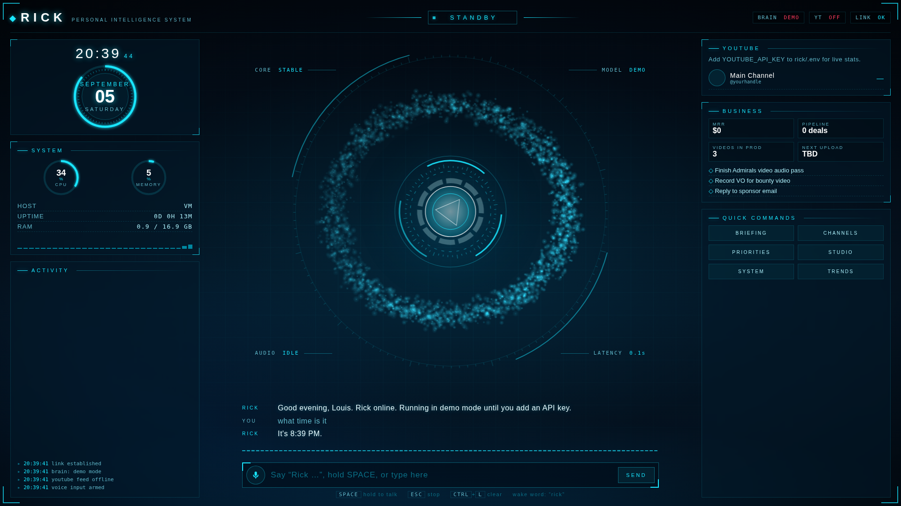

# RICK — your JARVIS-style desktop assistant

Rick is a full-screen, voice-driven HUD that lives on your computer. Say
"Rick, how are the channels doing?" and it pulls live YouTube numbers, reads
your business notes, opens apps and sites, sets timers, searches the web, and
talks back — with the swirling particle reactor and glowing cyan panels from
the Iron Man / JARVIS look you asked for.



## What it can do

| Ask Rick… | What happens |
|---|---|
| "Give me a briefing" | Pulls channel stats + your knowledge folder + dashboard and summarises out loud |
| "How's the main channel doing?" | Live subscribers / views / uploads via the YouTube Data API |
| "What were my last five uploads and how did they do?" | Recent videos with views, likes, comments |
| "What's in the pipeline?" / "What are my priorities?" | Reads and searches `knowledge/*.md` |
| "Remember that the sponsor deadline is Friday" | Writes to long-term memory (`data/memory.json`) |
| "Open YouTube Studio" / "Open Discord" | Launches apps or URLs from `rick.config.json` (or any URL / exe) |
| "Set a timer for 25 minutes, back to editing" | Rick speaks the reminder when it fires |
| "What's trending in the anime niche this week?" | Web search (Claude's built-in search tool) |
| "Focus mode" / "Pin a note: upload at 6" | Dims the panels / pins text on the HUD |
| "How's the system?" | CPU, RAM, uptime |

Everything Rick says is spoken aloud and shown in the transcript.

## Setup (Windows, 5 minutes)

1. Install [Node.js](https://nodejs.org) (LTS) if you don't have it.
2. Open this folder (`rick/`) and double-click **`start.bat`**.
   The first run installs dependencies and creates `.env`, then opens it in Notepad.
3. Paste your keys into `.env`:
   - `ANTHROPIC_API_KEY` — from https://console.anthropic.com (required for the real brain)
   - `YOUTUBE_API_KEY` — optional, for live channel stats. Google Cloud Console →
     enable **YouTube Data API v3** → Credentials → API key.
   - `ELEVENLABS_API_KEY` + `ELEVENLABS_VOICE_ID` — optional, for a more cinematic voice.
     Without it Rick uses the built-in Windows/Edge voices (Ryan / Guy natural voices sound great).
4. Edit `rick.config.json`:
   - `user` — your name.
   - `youtube.channels` — your channels: `{ "name": "Main", "handle": "@yourhandle" }`.
   - `apps` — nicknames for things you want Rick to open.
5. Run `start.bat` again. Rick boots, opens a fullscreen window in Chrome/Edge,
   and asks for microphone permission. Click **INITIALIZE**.

Mac / Linux: `./start.sh`. Or anywhere: `npm install && npm start`.

## Talking to Rick

- **Wake word**: just say "Rick …" (or "hey Rick"). After Rick answers you have
  about eight seconds to follow up without saying the name again.
- **Push to talk**: hold **SPACE** (or hold the mic button), speak, release.
- **Type**: the input bar at the bottom.
- **ESC** stops Rick talking and cancels a request. **Ctrl+L** clears the conversation.
- Talking over Rick while it is speaking interrupts it.

Voice recognition uses the browser's Web Speech API, so run Rick in **Chrome or
Edge** (the launcher finds them automatically). Firefox has no speech recognition.

## Teaching Rick about your business

- Put Markdown/text files in `knowledge/`. `business.md` and `channels.md` are
  starter templates — replace them with real notes. Rick lists, searches and
  reads these on demand.
- `knowledge/dashboard.json` drives the BUSINESS panel on the right (metrics + tasks).
- Say "remember that …" for durable facts. They go in `data/memory.json` and are
  injected into every conversation.

## Configuration

`rick.config.json`

| Key | Meaning |
|---|---|
| `name`, `user` | Assistant name and how it addresses you |
| `model`, `effort` | Claude model (default `claude-opus-5`) and effort level (`low`… `max`). `medium` keeps voice replies snappy |
| `personality` | Injected into the system prompt |
| `wakeWords` | Phrases that trigger a command |
| `voice.preferred` | Browser voice names to try, in order. `rate` / `pitch` tune delivery |
| `youtube.channels` | `{ name, handle }` or `{ name, id }` entries |
| `apps` | nickname → URL or executable |
| `allowShell` | `true` lets Rick run shell commands you ask for (off by default) |
| `webSearch` | enable Claude's built-in web search tool |

Env overrides: `RICK_PORT`, `RICK_MODEL`, `RICK_NO_BROWSER=1` (don't auto-open a window).

## How it's built

```
rick/
  server/index.js        Express + WebSocket server, launches the HUD window
  server/brain.js        Streaming Claude tool-use loop (Anthropic SDK)
  server/tools/          youtube.js  knowledge.js  memory.js  system.js  index.js (tool schemas + dispatcher)
  public/index.html      HUD layout
  public/hud.css         The look: cyan-on-navy panels, rings, gauges, scanlines
  public/reactor.js      Canvas particle torus + arc reactor core, reacts to state and audio level
  public/hud.js          Boot sequence, voice in/out, wake word, panels, WebSocket link
  knowledge/             Your notes (Rick reads these)
  data/                  memory.json + history.json (created at runtime, git-ignored)
```

The brain streams text to the HUD as it is generated and Rick starts speaking
each sentence as soon as it is complete, so replies feel immediate. Tool calls
show up in the ACTIVITY panel as they run. Claude's adaptive thinking is on,
and the request opts into Anthropic's server-side refusal fallbacks so an
occasional safety decline is retried on a fallback model instead of failing.

Without an `ANTHROPIC_API_KEY` Rick runs in **demo mode**: the full HUD, voice
and app-launching work, but replies are canned.

## Troubleshooting

- **No voice input**: make sure the window is Chrome/Edge and mic permission was
  allowed (the mic icon turns red if denied). Check Windows privacy settings → Microphone.
- **Rick doesn't speak**: click anywhere on the page once (browsers need a user
  gesture before audio), or check `voice.preferred` names against `speechSynthesis.getVoices()`.
- **"YOUTUBE_API_KEY not set"**: add the key to `.env` and restart.
- **Channel shows ERR**: the handle in `rick.config.json` is wrong. Use the exact `@handle` from the channel URL.
